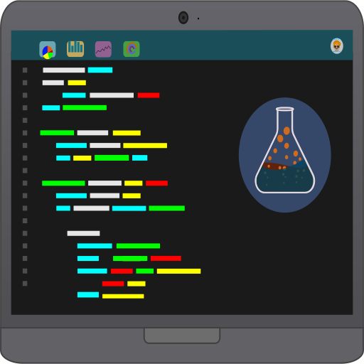

<a name="readme-top"></a>

<div align="center">

[![Contributors][contributors-shield]][contributors-url]
[![Forks][forks-shield]][forks-url]
[![Stargazers][stars-shield]][stars-url]
[![Issues][issues-shield]][issues-url]

<!-- PROJECT LOGO -->
<br />
  <a href="https://github.com/apsistec/dw-portfolio">
    
  </a>
  <h3 align="center">dw-portfolio</h3>
  <div style="width: 60%; padding: 10px;">
  <p align="left">
    An interactive portfolio PWA showcasing James Douglas White's skills and experience with the latest web technologies. Visitors can explore my past projects, gaining insights into my capabilities in areas like Angular, Ionic, Firebase, and GCP. The PWA design ensures a seamless and performant experience across any device, even when offline.
    </p>
   <a href="https://github.com/apsistec/dw-portfolio/src/assets/docs/resume.md">View James Douglas White's Resume</a>
   <br />
   <br />
    <a href="https://douglaswhite.app">View Demo</a>
    ·
    <a href="https://github.com/apsistec/dw-portfolio/issues/new?labels=bug&template=bug-report---.md">Report Bug</a>
    ·
    <a href="https://github.com/apsistec/dw-portfolio/issues/new?labels=enhancement&template=feature-request---.md">Request Feature</a>
    </div>
</div>
<details>
  <summary>Table of Contents</summary>
  <ul>
 <li><a href="#tech-stack">Tech Stack</a></li>
<li>
<a href="#getting-started">Getting Started</a>
</li>
   <li><a href="#installation">Installation</a>
  <ul>
   <li><a href="#acquire-accounts">Acquire Accounts</a></li>
   <li><a href="#add-pwa-features">Add PWA Features</a></li>
   <li><a href="#add-firebase">Add Firebase</a></li>
 <li><a href="#build-and-deploy">Build & Deploy</a></li>
  </ul>
  </li>
 <li><a href="#usage">Usage</a></li>
 <li><a href="#roadmap">Roadmap</a></li>
 <li><a href="#contributing">Contributing</a></li>
 <li><a href="#license">License</a></li>
 <li><a href="#contributors">Contributors</a></li>
 <li><a href="#acknowledgments">Acknowledgments</a></li>
  </ul>
</details>

## Tech Stack

- [Ionic](ionic-url)
- [Angular](angular-url)
- [Firebase](firebase-url)
- [Sendgrid](https://sendgrid.com)

## Getting Started

The following steps will help you get a local clone up and running

### Installation

1. Install [NodeJS](https://www.nodejs.com)

2. Clone the repo:

   `git clone https://github.com/apsistec/dw-portfolio.git`

3. Install NPM packages

   ` npm install`

4. Using npm, install:

   `npm install @angular/cli@latest --global`

   `npm install @ionic/cli@latest --global`

   `npm install firebase-tools@latest --global`

   `npm install @ionic/angular@latest`

### Acquire Accounts

1. Get a free Firebase Account at [https://firebase.com](https://firebase.com)
2. Get a free Sendgrid Account at [https://app.sendgrid.com](https://app.sendgrid.com)

### Add PWA Features

1. Install Angular PWA tools

   `ng add @angular/pwa`

2. Install & Run Capacitor Assets tool

   `npm i @capacitor/assets`

### Add Firebase

1. Install Angular Firebase tools

   `ng add @angular/fire`

2. Enter your Firebase API key

   `environments/environment.ts` & `environments/environment.prod.ts`

   Example:

   ```js
   export const environment = {
     production: "boolean",
     firebaseConfig: {
       apiKey: "string",
       authDomain: "string",
       databaseURL: "string",
       projectId: "string",
       storageBucket: "string",
       messagingSenderId: "string",
       appId: "string",
       measurementId: "string",
     },
   };
   ```

3. Initialize Firebase

   `firebase init`

   <p align="right">(<a href="#readme-top">back to top</a>)</p>

### Build & Deploy

1. Work on the app code with hot-reload

   `ionic serve`

2. Install Sendgrid

   `cd functions`

   `npm i @sendgrid/mail`

3. Compile the function code

   `npm install`

   `ng build`

   `cd -`

4. Compile the app code -production quality

   `ionic build --prod`

5. Deploy to Firebase Functions & Hosting

   `firebase deploy`

<p align="right">(<a href="#readme-top">back to top</a>)</p>

## Usage

Primary functions available in app

- _View and Print Douglas' Resume_ [(James (Doug)las White Resume)](src/assets/pdfs/resume.pdf)
- _Send Message to Douglas_ [(Sendgrid.com)][sendgrid-url]

## Roadmap

- [x] Add Changelog
- [x] Add Contact Page
- [ ] Add In App Messaging
- [ ] Improve Visualizations
- [ ] Add Authentication
- [ ] Add Menu

See the [open issues](https://github.com/apsistec/dw-portfolio/issues) for a full list of proposed features (and known issues).

<p align="right">(<a href="#readme-top">back to top</a>)</p>

## Contributing

Contributions are what make the open source community such an amazing place to learn, inspire, and create. Any contributions you make are **greatly appreciated**.

If you have a suggestion that would make this better, please fork the repo and create a pull request. You can also simply open an issue with the tag "enhancement".
Don't forget to give the project a star! Thanks again!

1. Fork the Project
2. Create your Feature Branch (`git checkout -b feature/Amazing Feature`)
3. Commit your Changes (`git commit -m 'Add some Amazing Feature'`)
4. Push to the Branch (`git push origin feature/Amazing Feature`)
5. Open a Pull Request to Main

## License

Distributed under the MIT License. See `LICENSE.txt` for more information.

<p align="right">(<a href="#readme-top">back to top</a>)</p>

## Contacts

Project Link: [https://github.com/apsistec/dw-portfolio](https://github.com/apsistec/dw-portfolio)

## Contributors


Douglas White

- [@apsistec](https://twitter.com/apsistec)

- <email@douglaswhite.dev>

- [www.douglaswhite.app](https://douglaswhite.app)

[![linkedin-shield]][linkedin-url]

## Acknowledgments

- [Ionic Framework][ionic-url]
- [Angular][angular-url]
- [Choose an Open Source License](https://choosealicense.com)
- [GitHub Emoji Cheat Sheet](https://www.webpagefx.com/tools/emoji-cheat-sheet)
- [Img Shields](https://shields.io)
- [IonIcons](https://ionicons.com)
- [Firebase][firebase-url]

<p align="right">(<a href="#readme-top">back to top</a>)</p>

<!-- MARKDOWN LINKS & IMAGES -->
<!-- https://www.markdownguide.org/basic-syntax/#reference-style-links -->

[avatar-url]: https://avatars0.githubusercontent.com/u/6438623?s=400&u=aaaf57f08f5fff530672ecd3a18f26a53f704850&v=4
[angular-url]: https://angular.dev/
[ionic-url]: https://ionicframework.com/
[firebase-url]: https://firebase.com/
[contributors-shield]: https://img.shields.io/github/contributors/apsistec/dw-portfolio.svg?style=for-the-badge
[contributors-url]: https://github.com/apsistec/dw-portfolio/graphs/contributors
[forks-shield]: https://img.shields.io/github/forks/apsistec/dw-portfolio.svg?style=for-the-badge
[forks-url]: https://github.com/apsistec/dw-portfolio/network/members
[stars-shield]: https://img.shields.io/github/stars/apsistec/dw-portfolio.svg?style=for-the-badge
[stars-url]: https://github.com/apsistec/dw-portfolio/stargazers
[issues-shield]: https://img.shields.io/github/issues/apsistec/dw-portfolio.svg?style=for-the-badge
[issues-url]: https://github.com/apsistec/dw-portfolio/issues
[license-shield]: https://img.shields.io/github/license/apsistec/dw-portfolio.svg?style=for-the-badge
[license-url]: https://github.com/apsistec/dw-portfolio/blob/master/LICENSE.txt
[linkedin-shield]: https://img.shields.io/badge/-LinkedIn-black.svg?style=for-the-badge&logo=linkedin&colorB=555
[linkedin-url]: https://linkedin.com/in/jamesdouglaswhite
[sendgrid-url]: https://sendgrid.co
