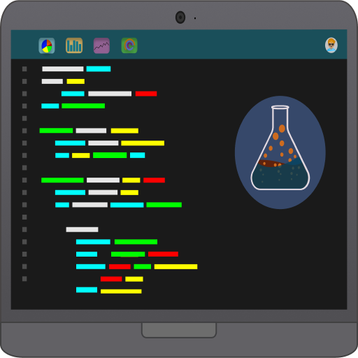

<!-- Improved compatibility of back to top link: See: https://github.com/apsistec/dw-portfolio/pull/73 -->

<a name="readme-top"></a>

<!--
*** Thanks for checking out the Best-README-Template. If you have a suggestion
*** that would make this better, please fork the repo and create a pull request
*** or simply open an issue with the tag "enhancement".
*** Don't forget to give the project a star!
*** Thanks again! Now go create something AMAZING! :D
-->

<!-- PROJECT SHIELDS -->
<!--
*** I'm using markdown "reference style" links for readability.
*** Reference links are enclosed in brackets [ ] instead of parentheses ( ).
*** See the bottom of this document for the declaration of the reference variables
*** for contributors-url, forks-url, etc. This is an optional, concise syntax you may use.
*** https://www.markdownguide.org/basic-syntax/#reference-style-links
-->

[![Contributors][contributors-shield]][contributors-url]
[![Forks][forks-shield]][forks-url]
[![Stargazers][stars-shield]][stars-url]
[![Issues][issues-shield]][issues-url]
[![MIT License][license-shield]][license-url]

<!-- PROJECT LOGO -->
<br />
<div align="center">
  <a href="https://github.com/apsistec/dw-portfolio">
    
  </a>

  <h3 align="center">dw-portfolio</h3>

  <p align="center">
    A progressive web app showcasing my web development skills.
    <br />
    <a href="https://github.com/apsistec/dw-portfolio"><strong>Explore the docs »</strong></a>
    <br />
    <br />
    <a href="https://github.com/apsistec/dw-portfolio">View Demo</a>
    ·
    <a href="https://github.com/apsistec/dw-portfolio/issues/new?labels=bug&template=bug-report---.md">Report Bug</a>
    ·
    <a href="https://github.com/apsistec/dw-portfolio/issues/new?labels=enhancement&template=feature-request---.md">Request Feature</a>
  </p>
</div>

<!-- TABLE OF CONTENTS -->

<details>
  <summary>Table of Contents</summary>
  <ol>
 <li>
 <a href="#about-the-project">About the Project</a>
 <ul>
   <li>
   <a href="#built-with">Built With</a>
   </li>
 </ul>
 </li>
 <li><a href="#support">Support</a></li>
 <li>
  <a href="#getting-started">Getting Started</a>
 <ul>
   <li><a href="#prerequisites">Prerequisites</a></li>
   <li><a href="#installation">Installation</a></li>
   </ul>
   </li>
 <li><a href="#usage">Usage</a></li>
 <li><a href="#roadmap">Roadmap</a></li>
 <li><a href="#license">License</a></li>
 <li><a href="#contact">Contact</a></li>
 <li><a href="#acknowledgments">Acknowledgments</a></li>
  </ol>
</details>

## Tech Stack

- [Ionic](https://ionicframework.com)
- [Angular](https://angular.io)
- [Firebase](https://firebase.com)
- [Sendgrid](https://sendgrid.com)

<!-- ABOUT THE PROJECT -->
## About The Project

A portfolio for Douglas White presenting some of the functionality available in
an Ionic progressive web application.

### Built With

- 
- 
- 

<p align="right">(<a href="#readme-top">back to top</a>)</p>

## Getting Started

To get a local copy up and running follow these simple example steps.

## Prerequisites

1. Install
   [NodeJS](https://www.nodejs.com)

2. Using npm, install:

`sh npm install @angular/cli@latest -global`

`sh npm install @ionic/cli@latest -global`

`sh npm install firebase-tools@latest -global`

## Acquire Accounts

1. Get a free Firebase Account at [https://firebase.com](https://firebase.com)
2. Get a free Sendgrid Account at [https://app.sendgrid.com](https://app.sendgrid.com)

## Installation

1. Clone the repo
   `sh git clone https://github.com/apsistec/dw-portfolio.git`

2. Install NPM packages
   `sh npm install`

3. Enter your APIs in `environments/environment.ts` and `environments/environment.prod.ts`

   ````js
     export const environment = {
       production: "boolean",
       firebaseConfig: {
         apiKey: "...",
         authDomain: "...",
         databaseURL: "...",
         projectId: "...",
         storageBucket: "...",
         messagingSenderId: "...",
         appId: "...",
         measurementId: "...",
       },
       stripePubKey: "pk_test_ API",
       taxRates: ["enter API"],
     };```

   ````

## Build and Deploy

1. Work on the app code with hot-reload

   ````sh
   ionic serve```

   ````

2. Compile the function code

   ````sh
   cd functions```

   ```sh
   npm install```

   ```sh
   ng build```

   ```sh
   cd -```

   ````

3. Compile the app code -production quality

   ````sh
   ionic build --prod```

   ````

4. Deploy to Firebase Authentication, Hosting, Database, Serverless and Storage

   ````sh
   firebase deploy```
   ````

<!-- USAGE EXAMPLES -->

## Usage

Primary functions available in app

- _View and Print Resume [James (Doug)las White Resume](src/assets/resume.pdf)_
- _Send Message [Sendgrid.com][sendgrid-url]_

<p align="right">(<a href="#readme-top">back to top</a>)</p>

<!-- ROADMAP -->

## Roadmap

- [x] Add Changelog
- [x] Add back to top links
- [ ] Add "components" document to easily copy & paste sections of the readme
- [ ] Multi-language Support
  - [ ] Chinese
  - [ ] Spanish

See the [open issues](https://github.com/apsistec/dw-portfolio/issues) for a full list of proposed features (and known issues).

<p align="right">(<a href="#readme-top">back to top</a>)</p>

<!-- CONTRIBUTING -->
## Contributing

Contributions are what make the open source community such an amazing place to learn, inspire, and create. Any contributions you make are **greatly appreciated**.

If you have a suggestion that would make this better, please fork the repo and create a pull request. You can also simply open an issue with the tag "enhancement".
Don't forget to give the project a star! Thanks again!

1. Fork the Project
2. Create your Feature Branch (`git checkout -b feature/Amazing Feature`)
3. Commit your Changes (`git commit -m 'Add some Amazing Feature'`)
4. Push to the Branch (`git push origin feature/Amazing Feature`)
5. Open a Pull Request

<p align="right">(<a href="#readme-top">back to top</a>)</p>

<!-- LICENSE -->
## License

Distributed under the MIT License. See `LICENSE.txt` for more information.

<p align="right">(<a href="#readme-top">back to top</a>)</p>

<!-- CONTACT -->
## Contact and Support

Douglas White

- [@apsistec](https://twitter.com/apsistec)

- <email@douglaswhite.dev>

- [website](https://douglaswhite.app)

[![LinkedIn][linkedin-shield]][linkedin-url]

Project Link: [https://github.com/apsistec/dw-portfolio](https://github.com/apsistec/dw-portfolio)

<p align="right">(<a href="#readme-top">back to top</a>)</p>

## Contributors/People

![**Apsistec**][avatar-url]

<p align="right">(<a href="#readme-top">back to top</a>)</p>

<!-- ACKNOWLEDGMENTS -->
## Acknowledgments

- [Ionic Framework][ionic-url]
- [Angular][angular-url]
- [Choose an Open Source License](https://choosealicense.com)
- [GitHub Emoji Cheat Sheet](https://www.webpagefx.com/tools/emoji-cheat-sheet)
- [Img Shields](https://shields.io)
- [IonIcons](https://ionicons.com)
- [Firebase][firebase-url]

<p align="right">(<a href="#readme-top">back to top</a>)</p>

<!-- MARKDOWN LINKS & IMAGES -->
<!-- https://www.markdownguide.org/basic-syntax/#reference-style-links -->

[avatar-url]: https://avatars0.githubusercontent.com/u/6438623?s=400&u=aaaf57f08f5fff530672ecd3a18f26a53f704850&v=4
[angular-url]: https://angular.dev/
[ionic-url]: https://angular.dev/
[firebase-url]: https://firebase.com/
[contributors-shield]: https://img.shields.io/github/contributors/apsistec/dw-portfolio.svg?style=for-the-badge
[contributors-url]: https://github.com/apsistec/dw-portfolio/graphs/contributors
[forks-shield]: https://img.shields.io/github/forks/apsistec/dw-portfolio.svg?style=for-the-badge
[forks-url]: https://github.com/apsistec/dw-portfolio/network/members
[stars-shield]: https://img.shields.io/github/stars/apsistec/dw-portfolio.svg?style=for-the-badge
[stars-url]: https://github.com/apsistec/dw-portfolio/stargazers
[issues-shield]: https://img.shields.io/github/issues/apsistec/dw-portfolio.svg?style=for-the-badge
[issues-url]: https://github.com/apsistec/dw-portfolio/issues
[license-shield]: https://img.shields.io/github/license/apsistec/dw-portfolio.svg?style=for-the-badge
[license-url]: https://github.com/apsistec/dw-portfolio/blob/master/LICENSE.txt
[linkedin-shield]: https://img.shields.io/badge/-LinkedIn-black.svg?style=for-the-badge&logo=linkedin&colorB=555
[linkedin-url]: https://linkedin.com/in/apsistec
[sendgrid-url]: https://sendgrid.com